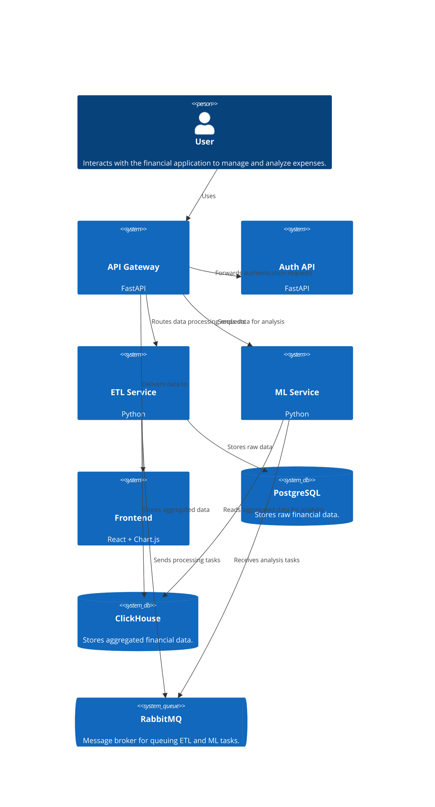
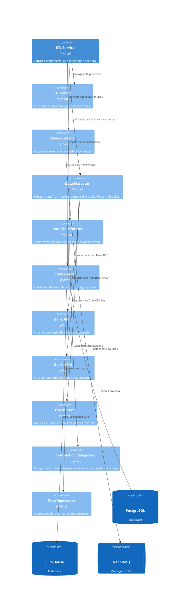
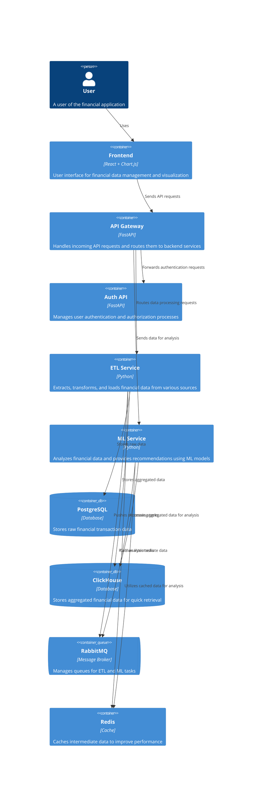

## Introduction
GOAL: Create an application for checking financial from multiple sources.

### Functional requirements
* Authentication
	* need mail and password
	* set JWT-token in cookies
- Construct reports 
	- report 1: all transactions grouped by type for set period
	- report 2:  biggest transaction value
	- report 3: transactions that more than it for previous period
	- report 4: transactions that have never met before
- Support downloading data from difference source (web-api, .csv, etc)
-  Reports could be export in .csv, excel, formats
- System can give recommends through analyzing expenses (base on ML models(probably any LLM))
- Combine data from multiple sources to single format

### Non-functional requirements
* The system response time to a user request should not exceed 2 seconds.
* The system should be available 99.9% of the time.
* All confidential data should be encrypted during transmission and storage.
* The system interface should be intuitive and convenient for users of all age groups.

### Components:
#### **1️⃣ Backend**

- **API Gateway**
    - **FastAPI**
    - **Redis** (optional, for caching and rate limiting)
- **Auth**
    - **Auth API**
    - **PostgreSQL**
    - **JWT / OAuth2** for authentication
- **ETL**
    - **ETL-Server**
    - **Orchestration** (Airflow, Dagster, Prefect)
    - **Monitoring** (Prometheus, Grafana, Sentry)
    - **Queue (RabbitMQ, Kafka)** — queue for ETL tasks
    - **Storage**
        - **ClickHouse** - aggregated data
        - **PostgreSQL** - raw data
    - **Redis** (for caching intermediate data, if needed)
    - **Worker** for retrieving data from bank's API (worker for each bank)
- **ML**
    - **Analyze-Worker** — analyzes expenses and provides recommendations
    - **LLM-Worker** — calls **LLM models** for category matching or other data processing
    - **Queue (RabbitMQ, Kafka)** — queue for ML tasks
    - **Retry mechanisms** (for handling failed tasks)


#### **2️⃣ Graph and alalyze

- **React + Chart.js / D3.js** — visualization data
- **Plotly / Matplotlib** — for getting reports (pdf, .csv, excel)

### Requirements
#### Backend  
* Auth
	* API
		* sing on
		* sing in
			* set JWT token to cookies
* API-GATEWAY
	* has API 
		* for integrating with bank's by web-API 
		* for downloading data from bank's account by web-API or .csv file
		* for asking LLM model about dashbord data
		* for getting aggregated data from ETL-Service
			* scope
				* date
				* categories
				* type of source
					* sources:
						* bank (bank name)
						* draft (if pay by cash)
		* for changing categories for transaction
	* communicate with ETL-Services by queue
		* queue: 
			* etl-\<bank-name\>-auth-data
			* etl-draft
	* communicate with LLM-Workers by queue

* ETL-Service
	* Listening queue
	* Extract data from resources 
	* Transform it to general format
		* Mark type of a transaction
		* Join data by transactions' type
	* Load it to databases
		* Save raw data to Postgres 
			* single database for each bank and raw
		*  Join transformed data from resources to single table in ClickHouse
	* Interface to retrieve data by source, transactions' date, transactions' type by queue
* ML
	* Listening queue
	* Analyze-Worker
		* analyzes expenses and provides recommendations
	* **LLM-Worker** — calls **LLM models** for category matching or other data processing
	

#### Frontend
* Interface to retrieve data by source, transactions' date, transactions' type
* Show graphs:
- general - show all transactions grouped by type for set period
- highlights - type of  graphs that show strange transactions, biggest transaction value, transactions that more than it for previous period, transactions that have never met before
- Balance - income minus expenses

#### C4 Context Diagram


#### C4 Component Diagram for the ETL Service



#### C4 Container Diagram


```
financial-app/
│── backend/                 # Бэкенд-сервисы
│   ├── api-gateway/         # API Gateway (FastAPI)
│   ├── auth-service/        # Authentication service (FastAPI + PostgreSQL)
│   ├── etl-service/         # ETL сервис (Python + Airflow/Dagster/Prefect)
│   ├── ml-service/          # ML сервис (LLM, рекомендации, классификация категорий)
│   ├── shared/              # Общий код (модели, utils)
│── frontend/                # Фронтенд-приложение
│   ├── src/                 # Исходный код (React + Chart.js / D3.js)
│   ├── public/              # Статика
│   ├── tests/               # Тесты
│── infra/                   # Инфраструктура проекта
│   ├── docker/              # Dockerfiles и docker-compose
│   ├── k8s/                 # Kubernetes manifests
│   ├── terraform/           # Terraform (если облако)
│   ├── monitoring/          # Prometheus, Grafana, Sentry
│── scripts/                 # Утилитарные скрипты (запуск, миграции, отладка)
│── docs/                    # Документация (C4-модели, API, требования)
│── .github/                 # CI/CD пайплайны GitHub Actions
│── Makefile                 # Команды для сборки и деплоя
│── README.md                # Описание проекта
│── .gitignore               # Исключения для Git
│── .env.example             # Пример переменных окружения

```